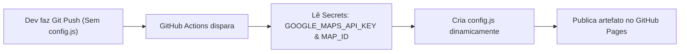

# Guia de Configuração: GitHub Pages & Secrets com GitHub Actions

Este documento explica detalhadamente como utilizar os **GitHub Secrets** e o **GitHub Actions** para gerar o arquivo `config.js` dinamicamente durante o deploy no **GitHub Pages**, garantindo que suas chaves de API nunca sejam expostas no histórico do repositório Git.

---

## 1. Visão Geral da Arquitetura

Em projetos web estáticos (sem backend), manter chaves de API fora do repositório público é uma boa prática essencial. O fluxo automatizado funciona da seguinte forma:



* **Repositório Git:** Fica 100% limpo, sem chaves reais commitadas (`config.js` fica no `.gitignore`).
* **GitHub Actions:** Executa gratuitamente a cada commit na branch principal, cria o `config.js` com os dados dos Secrets e faz o deploy do site.

---

## 2. Passo a Passo: Cadastrar as Variáveis (Secrets) no GitHub

### Passo 2.1: Acessar a Seção de Secrets
1. Acesse o seu repositório no [GitHub](https://github.com/).
2. No menu superior do repositório, clique na aba **Settings** (Configurações).
3. Na barra lateral esquerda, na seção **Security**, clique em **Secrets and variables** e depois em **Actions**.

---

### Passo 2.2: Cadastrar a Chave de API (`GOOGLE_MAPS_API_KEY`)
1. Clique no botão verde **"New repository secret"**.
2. Preencha os campos:
   * **Name:** `GOOGLE_MAPS_API_KEY`
   * **Secret:** Cole a sua chave de API gerada no Google Cloud (exemplo: `AIzaSyD-XXXXXXXXXXXXXXXXXXXXXXXXXXXXXX`).
3. Clique em **"Add secret"**.

---

### Passo 2.3: Cadastrar o Map ID (`GOOGLE_MAPS_MAP_ID`)
1. Clique novamente em **"New repository secret"**.
2. Preencha os campos:
   * **Name:** `GOOGLE_MAPS_MAP_ID`
   * **Secret:** Cole o seu Map ID gerado no Google Cloud (exemplo: `a1b2c3d4e5f67890` ou `DEMO_MAP_ID`).
3. Clique em **"Add secret"**.

---

## 3. Passo a Passo: Configurar a Fonte do GitHub Pages

Por padrão, o GitHub Pages tenta publicar direto de uma branch estática. Para utilizar a injeção via GitHub Actions:

1. Ainda na aba **Settings** do repositório, clique em **Pages** no menu lateral esquerdo.
2. Na seção **Build and deployment** > **Source**, selecione a opção:
   * **"GitHub Actions"** (em vez de *"Deploy from a branch"*).
3. A página salvará a configuração automaticamente.

---

## 4. Criar o Arquivo de Workflow (`.github/workflows/deploy.yml`)

Para que o GitHub saiba como montar o `config.js` e publicar o site, crie o arquivo `.github/workflows/deploy.yml` na raiz do seu projeto com o seguinte conteúdo:

```yaml
name: Deploy vetPerto no GitHub Pages

on:
  push:
    branches: ["main"] # Altere para "master" caso sua branch principal seja master
  workflow_dispatch:   # Permite disparar o deploy manualmente pela aba Actions

permissions:
  contents: read
  pages: write
  id-token: write

concurrency:
  group: "pages"
  cancel-in-progress: false

jobs:
  deploy:
    environment:
      name: github-pages
      url: ${{ steps.deployment.outputs.page_url }}
    runs-on: ubuntu-latest
    steps:
      - name: Baixar código do repositório
        uses: actions/checkout@v4

      - name: Gerar config.js a partir dos Secrets
        run: |
          cat <<EOF > config.js
          const GOOGLE_MAPS_CONFIG = {
            apiKey: "${{ secrets.GOOGLE_MAPS_API_KEY }}",
            mapId: "${{ secrets.GOOGLE_MAPS_MAP_ID }}",
            defaultCenter: { lat: -3.7380, lng: -38.5020 },
            defaultZoom: 15
          };
          EOF

      - name: Configurar ambiente do GitHub Pages
        uses: actions/configure-pages@v5

      - name: Empacotar artefatos do site
        uses: actions/upload-pages-artifact@v3
        with:
          path: '.'

      - name: Publicar no GitHub Pages
        id: deployment
        uses: actions/deploy-pages@v4
```

---

## 5. Como Funciona o Desenvolvimento Local vs Produção

| Ambiente | Origem do `config.js` | O que fazer |
| :--- | :--- | :--- |
| **Local (na sua máquina)** | Arquivo `config.js` local | Crie o arquivo `config.js` manualmente copiando de `config.example.js` e inserindo suas credenciais de teste. |
| **Produção (GitHub Pages)** | Injetado pelo GitHub Actions | O workflow gera o `config.js` automaticamente em tempo de execução usando os Secrets. |

> [!IMPORTANT]
> Certifique-se de que o arquivo `.gitignore` contenha `config.js` para não enviar sua chave local ao GitHub durante o `git push`.

---

## 6. Configuração Obrigatória no Google Cloud Console

Para que as requisições vindas do GitHub Pages sejam aceitas pelo Google Maps, você deve adicionar a URL do seu site nas **Restrições de Referenciador HTTP** no Google Cloud Console:

1. Acesse o [Google Cloud Console > Credenciais](https://console.cloud.google.com/google/maps-apis/credentials).
2. Clique na sua chave de API para editar.
3. Em **Restrições de site**, adicione a URL do seu GitHub Pages com curinga:
   ```text
   https://<seu-usuario>.github.io/*
   ```
4. Se o repositório possuir um subcaminho (ex.: `https://seu-usuario.github.io/clinica-pet/`), o padrão acima `https://<seu-usuario>.github.io/*` cobrirá perfeitamente todas as páginas.

---

## 7. Verificação e Diagnóstico de Erros

Após fazer o `git push`:
1. Acesse a aba **Actions** no topo do seu repositório no GitHub.
2. Acompanhe a execução do workflow **"Deploy vetPerto no GitHub Pages"**.
3. Quando o status ficar verde (concluído), o link direto para o site publicado será exibido na tela.
4. Caso o mapa apresente tela cinza com erro:
   * Abra as Ferramentas de Desenvolvedor no navegador (**F12** > **Console**).
   * Se exibir `RefererNotAllowedMapError`: verifique se a URL do GitHub Pages foi adicionada corretamente nas restrições da chave no Google Cloud.
   * Se exibir `ApiNotActivatedMapError`: confirme se a **Maps JavaScript API** foi ativada no projeto do Google Cloud.
